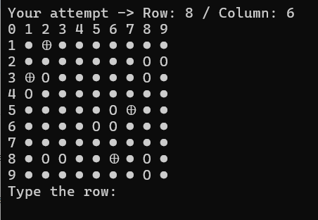

# Battleship Game

Guess row and column to find all the ships in the matrix to win the game.

## Battleship game board

## Requirements:

>Windows

>Linux

## Ships repository:

All ships are randomly included in a pre-defined size matrix

## Task list:

Include an option for the player to define the size of the game matrix 